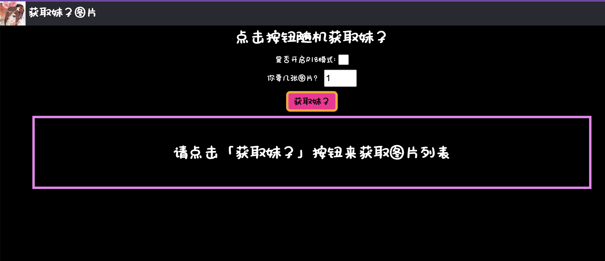

# 一个获取二次元妹子的网站
本站支持绅士模式，大家都懂的，所以不太方便给大家预览啥的，需要的自己拉项目去玩

## 预览图

## 技术栈
本项目使用 **Nuxt 3 + Vue 3** 搭建，我关闭了SSR（服务端渲染）模式，需要的可以自己打开.

至于为啥关了，是因为我还没研究透Nuxt 3哈哈，SSR模式下打包出来的服务器改不了端口，默认3000，我查了一圈，也翻了官方文档，愣是没看到打包出来的文件怎么修改端口。

**注意，即使是使用node xxx --port=xxx 啥啥啥也不管用**

## 本地运行
### 提醒
您需要`Node.js`环境才能运行该项目，如果没有安装，请去下载：

Node.js英文官网下载链接: [https://nodejs.org/en/download](https://nodejs.org/en/download)

Node.js中文网: [http://nodejs.p2hp.com/](http://nodejs.p2hp.com/)

### 方法

1. 拉取项目
~~~shell
git clone https://github.com/Vincent-the-gamer/meizi-webui.git
~~~

2. 安装依赖
~~~shell
# 在项目根目录下打开终端，运行
yarn install # 前端

# 在 项目根目录/server 目录下打开终端
# 或者cd到该目录下，然后
# 为后端安装依赖
yarn install # 后端
~~~

3. 分别运行前端和后端

注意目录结构，server文件夹里面是后端

运行后端：
~~~shell
# 在 项目根目录/server 目录下打开终端
# 或者cd到该目录下，然后
yarn start
~~~

运行前端:
~~~shell
# 在项目根目录下
yarn run serve
~~~

注意：

本项目前端默认运行在`http://localhost:2333`

后端：`http://localhost:2334`

如果您在本地运行开发模式需要修改前端端口，则修改`nuxt.config.ts`的`devServer`的端口即可
~~~typescript
devServer: {
    host: "0.0.0.0",
    port: 2333  // 修改这个
}
~~~

## 部署到自己的服务器
因为功能点不多，我没有单独封装axios，所以请在`项目根目录/components/Main.vue`修改需要请求的后端地址。

### 步骤
#### 1. 修改`server文件夹`里面的`server.js`，
根据个人需求对端口进行修改
~~~js
// 2334就是你的后端端口，修改这个
app.listen(2334,() => {
    // 啥啥啥
})
~~~

#### 2. 在`项目根目录/components/Main.vue`里面找到
~~~typescript
 function getMeizi(){
    axios.get("http://localhost:2334/getMeizi",{
       // 此处省略
    })
 }
~~~

修改`localhost:2334`为后端的服务器和端口：`你的服务所在服务器的公网IP:你的端口`

#### 3. 打包前端项目
在项目根目录下运行
~~~shell
yarn run generate # 不使用服务端渲染，打包成静态网页
~~~
打包获得一个.output文件夹，然后

**把里面的public文件夹整个拷贝出来放进server文件夹**

这样，我们就把前后端都整合到到server文件夹了，好处是，使用同一个node.js项目，通过运行不同的命令就可以同时启动前后端了

#### 4. 在`server.js`和`client.js`中配置好端口即可提交到服务器

注意，`server.js`的端口要和`Main.vue`中所请求端口一致，我们之前配好的话，这里就不要动，只需要把`client.js`改成你想部署前端的端口即可

#### 5. 在服务器中安装相应依赖，然后启动

安装依赖这块和前面一样，不再赘述

运行项目：

~~~shell
# 启动前端
yarn run start-page

# 启动后端
yarn run start-server
~~~
